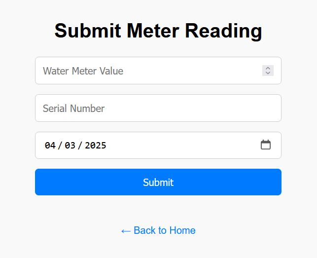
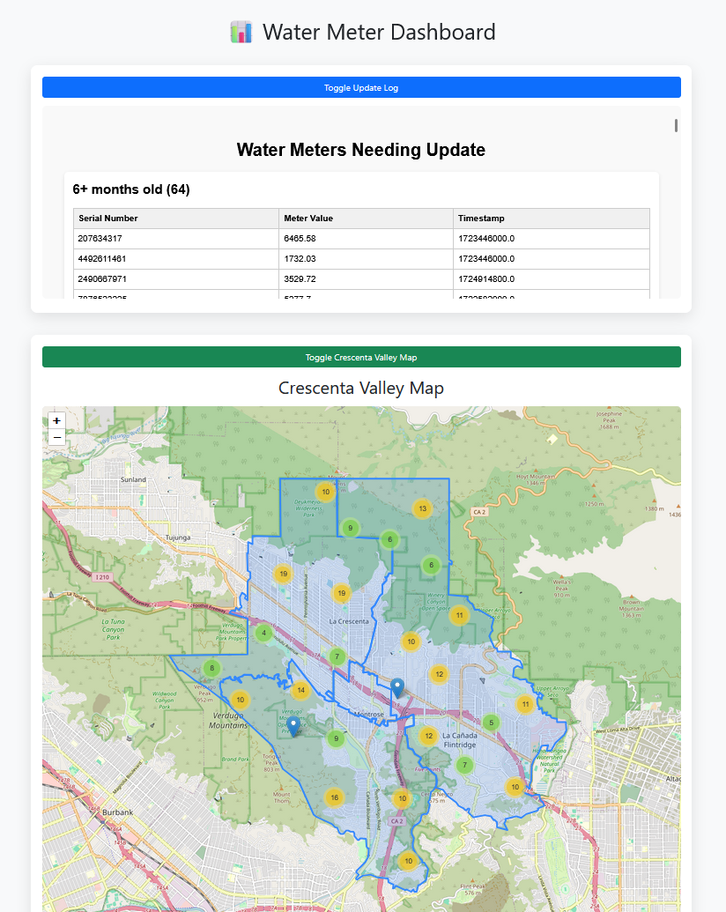

# Table of Contents

1. [Water Meter Dashboard](#water-meter-dashboard)
    - [AWS Project Workflow](#aws-project-workflow)
    - [Data Submission](#1-data-submission)
    - [Database Update](#2-database-update)
    - [Data Processing Pipeline](#3-data-processing-pipeline)
    - [Map Generation and Dashboard Generation](#4-map-generation-and-dashboard-generation)
    - [Static Content Delivery & Access Control](#5-static-content-delivery--access-control)
    - [Monitoring & Security](#6-monitoring--security)
2. [U-Net Meter Segmentation Feature](#u-net-meter-segmentation-feature)
    - [Overview](#overview)
    - [Work in Progress](#work-in-progress)
    - [GIF of Progress](#gif-of-progress)
    - [Model Architecture](#model-architecture)

---

# Water Meter Dashboard

## AWS Project Workflow

This project enables field technicians or users to submit water meter data that is visualized in near real-time on an interactive map. The architecture is built for scalability, automation, and low-latency updates using a modular, serverless approach powered by AWS services [(view live demo of workflow)](https://drive.google.com/file/d/1K_2wGWFdZhw46Fv4g9pNZOPICaVLu2u8/view?usp=sharing).

## 1. Data Submission

Users fill out a simple form on a static website hosted in Amazon S3.

When they hit "submit," the form sends the data to an API Gateway, which acts as the secure entry point to the backend.

From there, AWS Lambda kicks in to process the submitted information.

**Summary:** Users enter in meter values into a form. When they click submit, the web application sends a signal to a function to process the data and update the database.

<p align="center"></p>

---

## 2. Database Update

The Lambda function first checks the data to make sure it’s valid, then stores it in Amazon DynamoDB, a scalable NoSQL database.

When new data is added, DynamoDB Streams automatically triggers another Lambda function, known as the stream-handler, to take the next steps.

**Summary:** When the database is updated, there are functions that are listening to handle the next step.

<p align="center"></p>

---

## 3. Data Processing Pipeline

The stream-handler function cleans up and formats the data. It then sends a message to an Amazon SQS queue called `df-queue`.

This queue triggers a second Lambda function called `df-updater`, which processes the data one message at a time — this avoids race conditions and keeps data safe from corruption.

Once processed, the `df-updater` updates a JSON file in S3 which acts as the source of truth for map and dashboard visuals.

**Summary:** The listener function cleans the data and sends it to a queueing system. The queueing system sends the data to another function in an orderly manner to prevent overwhelming the system.

<p align="center"></p>

---

## 4. Map Generation and Dashboard Generation

Once the JSON file is updated, the `df-updater` sends a new message to two different SQS queues: `map-gen-queue` and `dashboard-gen-queue`. Each one triggers a dedicated Lambda function:

- One builds a fresh interactive map using the Python library **Folium**
- The other generates a new HTML dashboard with updated metrics

Both files (map + dashboard) are saved and uploaded to S3, replacing the old versions.

**Summary:** The updated data triggers map and dashboard creation → new visuals are uploaded → users see the latest version online.

<p align="center"></p>

---

## 5. Static Content Delivery & Access Control

The entire website — including the web form and visuals — is served through Amazon CloudFront, AWS’s CDN, ensuring fast loading no matter where users are.

User authentication is managed by Amazon Cognito, so only approved users (like field techs) can log in.

A CloudFront Function also controls page access, redirecting any unauthorized attempts.

**Summary:** CloudFront delivers fast web access → Cognito handles login → only approved users can see protected areas.

<p align="center"></p>

---

## 6. Monitoring & Security

All services are tracked using **CloudWatch Logs**, enabling performance monitoring and alerting on any issues.

**AWS IAM roles** are used to restrict permissions so that every component can only access what it absolutely needs — following the principle of least privilege.

All communication between services (like API Gateway to Lambda, or S3 uploads) is authenticated and encrypted.

**Summary:** CloudWatch logs the activity of all the functions, allowing for monitoring and debugging. IAM roles restrict what each function/resource is allowed to do, adding an additional layer of security.

<!-- <p align="center"></p> -->

---

# U-Net Meter Segmentation Feature

## Overview

This project is part of a bigger project. I'm building an app that helps visualize and extract water meter readings automatically. The idea is to let users upload an image of a water meter, have a model segment the meter region, and then run Tesseract to read the digits inside. Once the model is complete, this feature will be added to the AWS app [(Go to AWS deployment details)](./scripts/aws/README.md).

## Work in Progress

Currently, I'm training a U-NET model that uses grayscale images for segmentation. I'm exploring various loss functions to improve generalization. Although the biggest issue is generalization, I believe that by adding a dropout node and using image augmentation, I'll be able to improve validation loss.

Right now, the best results so far came from using:

    Learning rate: 0.0001

    Loss: Binary cross-entropy with class weighting (1.0 for background, 8.0 for foreground)

    Optimization: Adam

It does pretty well on the training set but falls apart on the test set. Validation loss is comparatively lower, so it's overfitting a bit. I'm currently trying out a combo loss function that combines BCE and Dice, a decaying learning rate, etc., to help with that.

## GIF of Progress


## Model Architecture

```txt
__________________________________________________________________________________________________
 Layer (type)                Output Shape                 Param #   Connected to                  
==================================================================================================
 input_1 (InputLayer)        [(None, 512, 512, 1)]        0         []                            
                                                                                                 
 conv2d (Conv2D)             (None, 512, 512, 64)         640       ['input_1[0][0]']             
                                                                                                 
 conv2d_1 (Conv2D)           (None, 512, 512, 64)         36928     ['conv2d[0][0]']              
                                                                                                 
 ... (model architecture continues) ...

 conv2d_18 (Conv2D)          (None, 512, 512, 64)         36928     ['conv2d_17[0][0]']           
                                                                                                 
 conv2d_19 (Conv2D)          (None, 512, 512, 1)          65        ['conv2d_18[0][0]']           
                                                                                                 
==================================================================================================
Total params: 31116161 (118.70 MB)
Trainable params: 31116161 (118.70 MB)
Non-trainable params: 0 (0.00 Byte)
__________________________________________________________________________________________________
```

