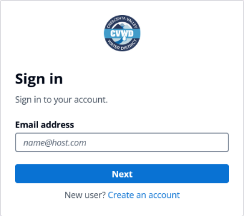
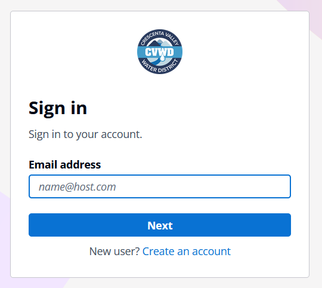

# AWS Project Workflow

This project enables field technicians or users to submit water meter data that is visualized in near real-time on an interactive map. The architecture is built for scalability, automation, and low-latency updates using a modular, serverless approach powered by AWS services [(view live demo of workflow)](https://drive.google.com/file/d/1K_2wGWFdZhw46Fv4g9pNZOPICaVLu2u8/view?usp=sharing).

## 1. Data Submission

Users fill out a simple form on a static website hosted in Amazon S3.

When they hit "submit," the form sends the data to an API Gateway, which acts as the secure entry point to the backend.

From there, AWS Lambda kicks in to process the submitted information.

**Summary:** Users enter in meter values into a form. When they click submit, the web application sends a signal to a function to process the data and update the database.

---

## 2. Database Update

The Lambda function first checks the data to make sure it’s valid, then stores it in Amazon DynamoDB, a scalable NoSQL database.

When new data is added, DynamoDB Streams automatically triggers another Lambda function, known as the stream-handler, to take the next steps.

**Summary:** When the database is updated, there are functions that are listening to handle the next step.

---

## 3. Data Processing Pipeline

The stream-handler function cleans up and formats the data. It then sends a message to an Amazon SQS queue called `df-queue`.

This queue triggers a second Lambda function called `df-updater`, which processes the data one message at a time — this avoids race conditions and keeps data safe from corruption.

Once processed, the `df-updater` updates a JSON file in S3 which acts as the source of truth for map and dashboard visuals.

**Summary:** The listener function cleans the data and sends it to a queueing system. The queueing system sends the data to another function in an orderly manner to prevent overwhelming the system.

---

## 4. Map Generation and Dashboard Generation

Once the JSON file is updated, the `df-updater` sends a new message to two different SQS queues: `map-gen-queue` and `dashboard-gen-queue`. Each one triggers a dedicated Lambda function:

- One builds a fresh interactive map using the Python library **Folium**
- The other generates a new HTML dashboard with updated metrics

Both files (map + dashboard) are saved and uploaded to S3, replacing the old versions.

**Summary:** The updated data triggers map and dashboard creation → new visuals are uploaded → users see the latest version online.

---

## 5. Static Content Delivery & Access Control

The entire website — including the web form and visuals — is served through Amazon CloudFront, AWS’s CDN, ensuring fast loading no matter where users are.

User authentication is managed by Amazon Cognito, so only approved users (like field techs) can log in.

A CloudFront Function also controls page access, redirecting any unauthorized attempts.

**Summary:** CloudFront delivers fast web access → Cognito handles login → only approved users can see protected areas.

---

## 6. Monitoring & Security

All services are tracked using **CloudWatch Logs**, enabling performance monitoring and alerting on any issues.

**AWS IAM roles** are used to restrict permissions so that every component can only access what it absolutely needs — following the principle of least privilege.

All communication between services (like API Gateway to Lambda, or S3 uploads) is authenticated and encrypted.

**Summary:** CloudWatch logs the activity of all the functions, allowing for monitoring and debugging. IAM roles restrict what each function/resource is allowed to do, adding an additional layer of security.

---

## Next Steps

### Improve Scalability of the Application

The architecture will be enhanced to support horizontal scaling, ensuring consistent performance as usage grows. This includes refining Lambda concurrency limits, leveraging CloudWatch for proactive monitoring, and considering auto-scaling groups where applicable. If serverless limits are reached, the application may be migrated to AWS Amplify for frontend integration and EC2 instances for more customizable backend control.

### iOS and Android Integration

A mobile application will be developed for both iOS and Android to streamline on-site data entry and enhance accessibility for field technicians. AWS Amplify or API Gateway endpoints will support backend communication.

### Machine Learning Integration for Meter Detection

A U-Net neural network will be trained to locate water meters in images using semantic segmentation, which classifies each pixel to detect objects. The image will then be passed to an OCR (Optical Character Recognition) model to extract the numeric reading. This will allow technicians to simply take a photo of the meter, and the system will automatically identify the meter value. If the system misreads the value, technicians can submit corrections on the spot. These corrections will be fed back into the model to improve its accuracy over time using active learning.

### Queue-Based Technician Dispatch System

A technician dispatch mechanism using Amazon SQS and AWS Lambda will be implemented. It will prioritize jobs based on the time elapsed since the last meter update, ensuring timely interventions.

### Maintenance Request and Notification System

A system will be added to handle maintenance requests. Once a job is completed, the customer who submitted the report will automatically receive an update via email or text. This will enhance transparency and trust in the service.

---

## Appendix

### Login Page and Sign Up Page  

### Home Page  

### Insert Meter Value Page  

### Register New Meter Page  

### Dashboard Page (Uncollapsed and Collapsed)  

---

## Exhibit 1. User Flow

  <strong><em>Click the image to view live demo</em></strong> 
  

