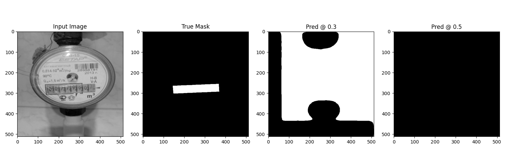

# Overview
Work-in-Progress
Currently best model is lr 0.0001, binary cross entropy loss fuction with weighted zeros (1.0) and ones (8.0)
however, did perform poorly on test set, val_loss wan't as good as train_loss
exploring models with a loss function that uses a mixture of bce and dice
using tesseract to predict the numbers inside the bounds of prediction
this is another feature that going to be added to the aws web app

## Model Architecture

[View model summary](../../assets/model_summary.txt)

## GIF of Progress
<!-- https://ezgif.com/maker -->

